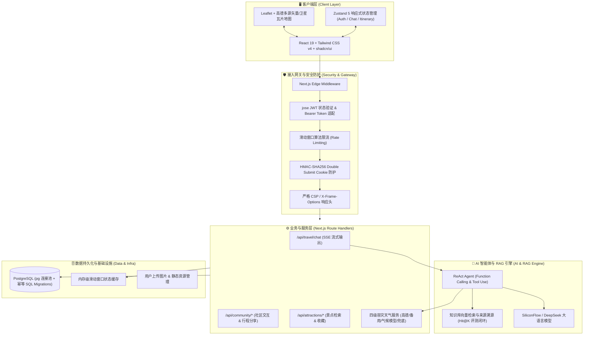

# 🌍 Travel AI - 智能旅行规划与行记助手

<p align="center">
  
  
  
  
  
  
  
</p>

<p align="center">
  基于 Next.js 16 App Router 与 React 19 构建的全栈现代化智能旅行助手。<br/>
  融合 <b>大模型流式 ReAct Agent</b>、<b>RAG 检索增强</b>、<b>高德地图轨迹交互</b> 与 <b>四级高可用容灾架构</b>。
</p>

---

## 🔗 在线体验

- **生产环境直达**: [https://joygytrip.cn](https://joygytrip.cn)
- **核心体验流**: 首页输入意向城市/天数 → AI 咨询生成结构化日程与路网轨迹 → 交互式地图沉浸式全屏预览 → 行程手账保存与社区发布。

---

## 🏛️ 系统架构



---

## ✨ 核心技术特色与工程亮点

### 1. 流式 ReAct Agent 与工具自动化调度
- **流式响应 (SSE)**：基于 Vercel AI SDK 深度定制 Server-Sent Events 流式通道，降低首字延迟（TTFT），支持随时打断与会话实时保存。
- **Tool Calling 协同**：大模型具备自主工具调用能力，动态挂载天气查询、知识库搜索、高德路径计算工具，生成含坐标、预算、景点的结构化路线。
- **信息溯源**：AI 回复自动提取真实景点知识库来源，以“参考来源”卡片呈现，杜绝大模型纯“幻觉”编造。

### 2. RAG 知识库检索与离线自动化评测
- 整合城市景点专属结构化知识库，支持自然语言检索与精准语义召回。
- 内置自动化评测套件（`pnpm rag:evaluate`），对 12 组基准旅行查询进行持续评测，输出 **Hit@1**、**Hit@3** 与 **MRR** 评测指标，确保模型检索改动可量化验证。

### 3. 四级高可用容灾天气服务
针对第三方气象 API 偶发波动、网络超时与超额限制，设计了递进式四级高可用架构：
1. **主通道**：高德地理气象 WebAPI
2. **第二通道**：备用高精度气象服务 API
3. **第三通道**：基于城市历史同期气象统计推算模型
4. **保底通道**：本地四季均值常态化兜底数据  
*确保无论外部网络与第三方依赖发生何种异常，大模型规划调用链 100% 成功返回，系统不崩盘。*

### 4. 深度地图交互与真实导航闭环
- 基于 Leaflet 实现轻量级无缝地图体验，支持高德标准路网与高德卫星实景瓦片自由平滑切换。
- 支持全屏沉浸式地图模式、路线轨迹分段动态绘制、动态缩放适应（Fit Bounds）与一键唤起高德地图原生 App/网页导航。

### 5. 企业级全链路安全规范
- **现代化认证体系**：基于 `jose` 在 Edge Runtime 中校验 JWT，无缝支持移动端 Bearer Token 与 Web 端 HttpOnly/Secure Cookie。
- **CSRF 纵深防御**：采用 HMAC-SHA256 签名的 Double Submit Cookie 方案，安全方法自动放行，非幂等修改强制验签。
- **请求限流与配额保护**：滑动窗口内存算法，基于用户 ID 与客户端 IP 双维度防恶意暴力刷量，并限制单日 AI 调用配额。

### 6. 轻量化生产环境的极致资源优化
- 针对低规格（1.8G 内存）生产节点，采用**「本地编译打包 + 产物精简部署」**策略。
- 生产环境依赖安装时通过 `--prod` 剔除 900+ 开发依赖包，并结合 `NODE_OPTIONS='--max-old-space-size=768'` 和并发控制，彻底规避小内存主机在构建或依赖安装阶段触发 OOM。

---

## 🧪 严苛的自动化测试套件

项目拥有完整的单元测试与集成测试覆盖，基于 **Vitest** 运行，测试范围覆盖工具库、API 路由、React Hook、状态切片与异常边界：

```bash
Test Files  46 passed (46)
     Tests  269 passed (269)
```

- **认证与安全**: JWT 生成与解构、密码强校验、CSRF 验签、限流滑动窗口测试。
- **AI 与数据流**: 对话流式封装、Message Parts 结构规范化、RAG 命中率评测。
- **业务与容灾**: 景点收藏事务、社区发帖/点赞逻辑、天气四级容灾降级路径模拟。
- **地理算法**: 坐标转换、高德导航 URI 编码生成、轨迹几何计算。

运行测试命令：
```bash
pnpm test:run    # 运行一次完整测试套件
pnpm typecheck   # 运行 TypeScript 严格类型检查
```

---

## 🚀 快速本地开发

### 1. 环境准备
- Node.js >= 20.x
- pnpm >= 9.x
- PostgreSQL >= 14.x

### 2. 安装项目依赖
```bash
pnpm install
```

### 3. 配置环境变量
复制环境变量模版并填入基础配置：
```bash
cp .env.example .env
```
必填配置项：
- `JWT_SECRET`: 至少 32 位随机字符
- `DATABASE_URL`: PostgreSQL 数据库连接串
- `SILICONFLOW_API_KEY`: 兼容 OpenAI 协议的模型 API 密钥

### 4. 数据库初始化与种子填充
```bash
# 执行数据库表结构迁移（幂等）
pnpm db:migrate

# 注入基础景点与标签种子数据
pnpm db:seed:attractions
```

### 5. 启动开发服务器
```bash
pnpm dev
```
打开浏览器访问 [http://localhost:3000](http://localhost:3000)。

---

## 📋 常用工程脚本命令

| 命令 | 描述 |
| :--- | :--- |
| `pnpm dev` | 启动 Next.js 极速开发服务（基于 Turbopack） |
| `pnpm build` | 执行生产环境编译打包 |
| `pnpm start` | 启动生产环境 Next.js 运行时 |
| `pnpm typecheck` | 执行 TypeScript 完整类型静态检查 |
| `pnpm test:run` | 执行 Vitest 全量单元与集成测试套件 |
| `pnpm db:migrate` | 执行增量 SQL Migrations 迁移 |
| `pnpm rag:evaluate` | 运行 RAG 离线检索召回率自动化评测 |
| `./deploy.sh` | 执行一键自动化远程安全部署流程 |

---

## 📁 项目工程目录

```
src/
├── app/                    # Next.js App Router 页面 & API 路由
│   ├── api/                # 全栈 API Handlers (auth, travel, community, weather, cities)
│   ├── (pages)/            # 页面视图 (chat, attractions, community, profile, etc.)
│   └── globals.css         # 现代化全局样式与主题变量
├── components/             # React 表现层组件
│   ├── ui/                 # 基础设计系统原子组件 (Tailwind + Radix UI)
│   ├── map/                # 地图瓦片、点位标记与轨迹可视化组件
│   ├── card/               # 行程卡片、景点卡片与海报弹窗
│   └── home/               # 首页各模块展示组件
├── lib/                    # 核心系统服务与工具集
│   ├── ai/                 # Vercel AI SDK 流式封装、工具集合 (Tools)、RAG 评测
│   ├── services/           # 业务逻辑服务层 (auth, weather, community, attractions)
│   ├── map/                # 地理坐标计算与高德导航协议生成
│   └── utils/              # 安全与基础设施 (csrf, http, logger, validation, rateLimit)
├── stores/                 # Zustand 响应式全局状态树
├── db/                     # SQL Migrations 数据库定义与迁移脚本
├── knowledge/              # 专属景点知识库数据 (用于 RAG 检索)
└── types/                  # 全局 TypeScript 强类型定义
```

---

## 📄 开源许可证

本项目基于 [MIT 许可证](LICENSE) 开源发布。
